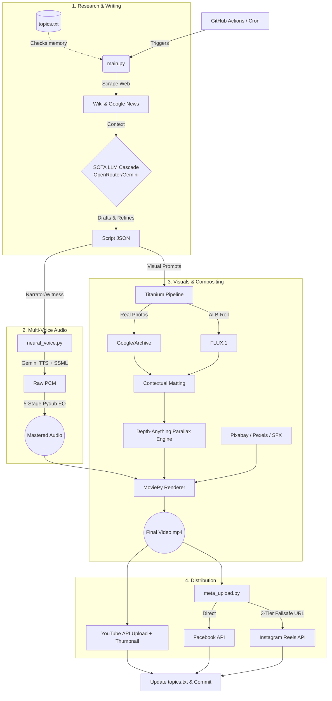

# GhostBot 👻🤖 (v2.0: The Documentary Pipeline)
> Autonomous, State-of-the-Art (SOTA) True Crime video generator and multi-platform publisher powered by an LLM Cascade, 2.5D Computer Vision, and GitHub Actions.

GhostBot is a fully automated, end-to-end video production studio engineered specifically for high-retention True Crime and Mystery content. It has evolved from a simple text-to-video bot into a **programmatic documentary engine**. 

Designed to run completely hands-off in the cloud, the bot handles everything from live web research and multi-draft scriptwriting to 2.5D parallax rendering, 5-stage audio mastering, and automated distribution across YouTube, Facebook, and Instagram.

### 🎬 The Final Result: Hands-Free Content

*Fully rendered, highly engaging True Crime videos automatically uploaded and optimized for YouTube and Meta.*

---

## 🔥 What's New in v2.0
* **Live Research Engine:** Scrapes Wikipedia and Google News RSS dynamically before writing the script to ensure 100% factual accuracy and historical context.
* **The "Titanium" Visual Pipeline:** A 4-layer visual engine. Fetches real historical photos (Wiki/Archive/Google) -> falls back to SOTA AI B-Roll (Cloudflare FLUX.1) -> falls back to Stock Footage (Pexels).
* **2.5D Depth Parallax:** Uses Hugging Face `transformers` (`Depth-Anything-V2-Small-hf`) and OpenCV to generate depth maps, animating flat images into immersive 3D environments with Cosine S-Curve camera easing.
* **Contextual Matting:** Eliminates the "AI Slop" look by programmatically wrapping images in diegetic borders (vintage Polaroids on a desk, CRT monitor scanlines, cinematic shadows) using `Pillow`.
* **Netflix-Style Karaoke Subtitles:** Custom-built dynamic font-scaling engine with native Pillow strokes. Highlights the active word in yellow without overlapping or cluttering the screen.
* **5-Stage Audio Mastering:** Applies true crime podcast EQ (80Hz High-Pass, 12kHz Low-Pass, dynamic compression, and normalization) to Gemini's TTS voices.
* **Dynamic Music & Stingers:** AI acts as a Music Supervisor, automatically querying Pixabay for the perfect ambient background track, while injecting cinematic impact SFX (booms, static, thuds) at key narrative beats.

---

## ⚙️ The Automation Engine (How It Works)
GhostBot is designed to be a "set-and-forget" system. Instead of relying on local hardware, the entire pipeline is orchestrated twice daily on Ubuntu GitHub Actions runners.

### 🏗️ System Architecture Pipeline



1. **Trigger:** The GitHub Action wakes up at 06:00 and 18:00 UTC.
2. **Writing:** The LLM Cascade (Llama 3.3 70b / Qwen / Gemini Flash) acts as a Detective, writing a paradox-driven, multi-voice script based on real web data.
3. **Assembly:** The bot renders SSML audio, fetches images, applies contextual matting, generates depth maps, applies OpenCV 3D parallax, and burns in Karaoke subtitles.
4. **Distribution:** The final asset (and a custom-generated PIL thumbnail) is pushed to YouTube. `meta_upload.py` handles Facebook and navigates a 3-tier temporary hosting failsafe (`file.io` → `catbox` → `tmpfiles`) to publish to Instagram.
5. **Memory Update:** The case is appended to `topics.txt`, committed to the repo by `github-actions[bot]`.

---

## 💻 Local Setup & Execution
If you want to run the core Python engine locally for testing, script generation, or manual rendering, follow the steps below.

### Prerequisites
1. Clone the repository:
    ```bash
    git clone [https://github.com/Kashyapman/GhostBot.git](https://github.com/Kashyapman/GhostBot.git)
    cd GhostBot
    ```

2. Install system dependencies (Ubuntu/Debian example):
    ```bash
    sudo apt-get install ffmpeg libsndfile1 sox imagemagick ghostscript libwebp-dev libjpeg-dev
    ```

3. Install the required Python dependencies:
    ```bash
    pip install -r requirements.txt
    ```

### Environment Variables & Secrets
For GitHub Actions (or your `.env` file) to run the pipeline successfully, ensure the following keys are configured:

**Core AI & Media Generation:**
* `GEMINI_API_KEY` - Primary TTS and fallback LLM.
* `OPENROUTER_API_KEY` - SOTA LLM Cascade (Llama 3.3, Qwen, Mistral).
* `CLOUDFLARE_ACCOUNT_ID` & `CLOUDFLARE_API_TOKEN` - For FLUX.1 High-End AI Image generation.
* `SEARCH_API_KEY` & `GOOGLE_CSE_ID` - For scraping real historical photo evidence.
* `PEXELS_API_KEY` - For cinematic atmospheric overlays (dust, rain, film grain).
* `PIXABAY_API_KEY` - For the AI Music Supervisor to fetch dynamic background scores.

**Social Distribution:**
* `YOUTUBE_TOKEN_JSON` - Authorized OAuth token JSON for automated uploading.
* `META_ACCESS_TOKEN` - Meta Graph API v19.0 token.
* `FB_PAGE_ID` & `IG_USER_ID` - Target accounts for Facebook and Instagram publishing.

*Note: Ensure your `GITHUB_TOKEN` under Action settings has **Read & Write** permissions so the bot can commit memory updates to `topics.txt`.*

---

## 📂 Repository Structure
* `.github/workflows/` - YAML configuration for the automated CI/CD pipeline.
* `music/` & `sfx/` - Fallback directories for background tracks and cinematic stingers.
* `main.py` - Core execution script orchestrating the rendering, rendering, and compositing.
* `meta_upload.py` - Dedicated module with resilient API bridging for Meta platforms.
* `neural_voice.py` - Manages the TTS engine, dynamic voice casting, and the 5-stage mastering chain.
* `topics.txt` - The bot's memory bank to prevent duplicating cases.

## 📝 License
This project is private and maintained for automated channel management.
