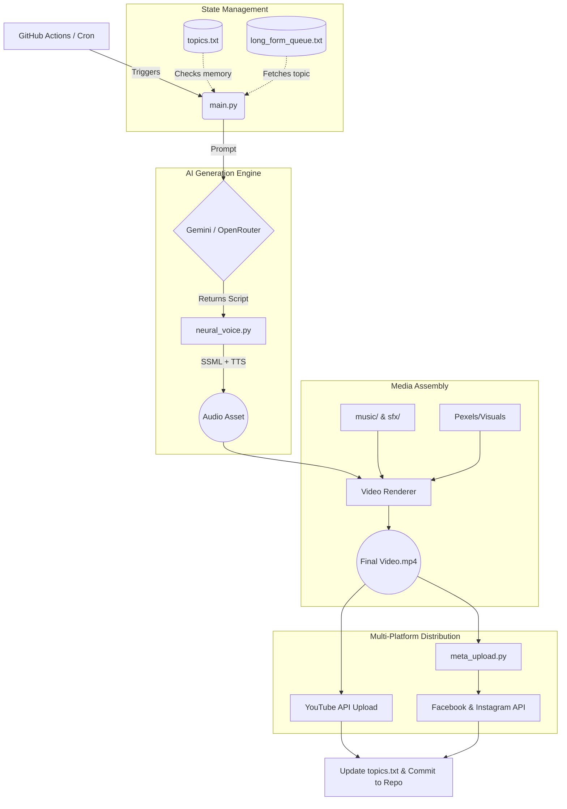

# GhostBot 👻🤖
> Autonomous True Crime video generator and multi-platform publisher powered by Gemini and GitHub Actions.

GhostBot is a fully automated, end-to-end video generation and multi-platform publishing pipeline engineered specifically for high-retention True Crime content. Designed to run completely hands-off, the bot handles everything from script generation and dynamic voiceovers to final asset rendering and uploading across multiple social networks.

### 🎬 The Final Result: Hands-Free Content

*Fully rendered, highly engaging True Crime videos automatically uploaded and optimized for YouTube and Meta.*

---

## 🌟 Key Features
* **Automated Content Pipeline:** Fully autonomous video generation flow requiring zero manual intervention.
* **Intelligent Scripting:** Utilizes a Gemini/OpenRouter fallback system to generate compelling, high-retention scripts.
* **Dynamic Voice Casting:** Leverages advanced Text-To-Speech with SSML pacing for realistic, dramatic, and engaging narration.
* **Multi-Platform Publishing:** Seamlessly uploads finished content to YouTube, Facebook, and Instagram simultaneously.
* **Automated Memory System:** Prevents duplicate content by logging processed `case_name`s to a text file and automatically committing the updates back to the repository.

---

## ⚙️ The Automation Engine (How It Works)
GhostBot is designed to be a "set-and-forget" system. Instead of relying on local hardware, the entire pipeline is orchestrated in the cloud.

### 🏗️ System Architecture Pipeline




*100% cloud-based execution via GitHub Actions. No local servers required.*

1. **Trigger:** The GitHub Action wakes up (either on a cron schedule or via manual dispatch).
2. **Topic Selection:** `main.py` cross-references `long_form_queue.txt` and `topics.txt` to select a new, unrepeated case.
3. **Generation:** AI models draft the script, while `neural_voice.py` crafts the audio with specific SSML pacing for dramatic effect.
4. **Assembly:** Visuals are pulled and combined with the `music` and `sfx` assets to render the final video.
5. **Distribution:** The final asset is pushed to YouTube via the core pipeline and to Meta platforms via `meta_upload.py`.
6. **Memory Update:** The new topic is written to `topics.txt`, and changes are committed back to the repository to prevent future duplicates.

---

## 💻 Local Setup & Execution
If you want to run the core Python engine locally for testing, script generation, or manual rendering, follow the steps below.


*The core Python engine generating scripts, parsing SSML, and rendering media locally.*

### Prerequisites
To run GhostBot locally or configure it on a new repository, you will need several API keys to handle generation, media sourcing, and uploading.

1. Clone the repository:
    ```bash
    git clone https://github.com/Kashyapman/GhostBot.git
    cd GhostBot
    ```

2. Install the required dependencies:
    ```bash
    pip install -r requirements.txt
    ```

### Environment Variables & Secrets
For GitHub Actions to run the pipeline successfully, ensure the following Repository Secrets are configured in your repository settings:

* `GEMINI_API_KEY` / `OPENROUTER_API_KEY` - For AI script generation.
* `PEXELS_API_KEY` - For fetching relevant B-roll footage and images.
* `YOUTUBE_API_KEY` / `CLIENT_SECRETS` - For YouTube OAuth and automated uploading.
* `META_API_KEY` / `ACCESS_TOKEN` - For Facebook and Instagram API access.
* **GitHub Token:** Ensure the default `GITHUB_TOKEN` under your Action settings has **Read & Write** permissions so the bot can commit memory updates to `topics.txt`.

---

## 📂 Repository Structure
* `.github/workflows/` - YAML configuration for the automated GitHub Actions pipeline.
* `music/` & `sfx/` - Directories for background tracks and sound effects.
* `main.py` - Core execution script orchestrating the video generation process.
* `meta_upload.py` - Dedicated module for Facebook and Instagram Graph API uploads.
* `neural_voice.py` - Manages the TTS engine, dynamic voice casting, and SSML.
* `long_form_queue.txt` & `topics.txt` - The bot's queue and memory bank to track cases.

## 📝 License
This project is private and maintained for automated channel management.
