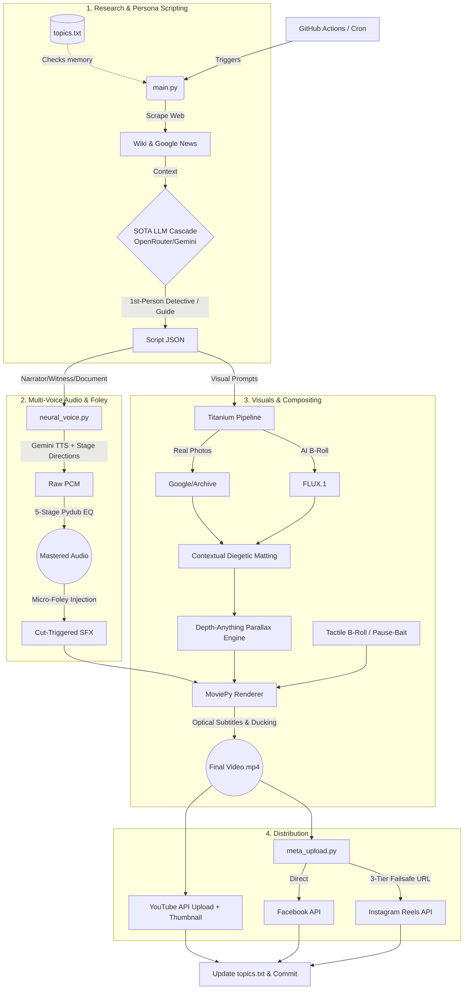

# GhostBot 👻🤖 (v4.0: The Programmatic Documentary Engine)
> Autonomous, State-of-the-Art (SOTA) high-retention video generator powered by an LLM Cascade, 3D Computer Vision, and psychological watch-time mechanics.

GhostBot is a fully automated, end-to-end video production studio engineered specifically for high-retention True Crime, Mystery, and Philosophical content. It has evolved from a simple text-to-video bot into a **programmatic documentary engine**. 

While standard automation scripts rely on generic stock footage and robotic voiceovers, GhostBot generates cinematic, human-grade edits. Designed to run completely hands-off in the cloud, the bot handles everything from live web research and multi-voice scriptwriting to 3D parallax rendering, dynamic audio ducking, and automated distribution across YouTube and Meta.

### 🎬 The Final Result: Hands-Free Content

*Fully rendered, highly engaging videos automatically uploaded and optimized for algorithmic velocity.*

---

## 🔥 What Makes v4.0 SOTA (State-of-the-Art)?
GhostBot v4.0 implements advanced psychological retention tactics used by top-tier human editors to drive Average Percentage Viewed (APV) past 100%:

* **The "Titanium" Visual Pipeline:** A 4-layer visual engine. Fetches real historical photos (Wiki/Archive/Google) -> falls back to SOTA AI B-Roll (Cloudflare FLUX.1) -> falls back to tactile Stock Footage (Pexels).
* **3D Depth Parallax Engine:** Uses Hugging Face `transformers` (`Depth-Anything-V2-Small-hf`) and OpenCV to generate depth maps, animating flat AI images into immersive 3D environments with Cosine S-Curve camera easing.
* **Contextual Diegetic Matting:** Eliminates the "AI Slop" look by programmatically wrapping images in physical borders (vintage Polaroids, ancient sacred scrolls, police evidence boards, or cinematic shadows) using Pillow.
* **Dynamic Audio-Visual Pacing:** Destroys the "metronome" effect of standard bots. Visual shot durations are mapped exactly to the millisecond length of the corresponding spoken dialogue line.
* **Kinetic Optical-Glow Subtitles:** A custom dual-pass rendering engine. Projects a heavy, diffuse neon optical glow (yellow/gold) behind the active spoken word while maintaining stark, high-contrast core typography.
* **Seamless Infinity Loop Architecture:** Grammatically connects the final spoken sentence to the opening hook, and cuts the video on the exact final audio frame to trigger undetectable viewer replays.
* **Sacred "Pause-Bait" Micro-Clues:** Injects hyper-detailed, text-dense AI visuals (like classified reports or ancient manuscripts) onto the screen for exactly 0.35 seconds to induce algorithmic re-watches and pauses.
* **Cut-Triggered Micro-Foley & Audio Ducking:** Mathematically syncs subtle sound effects (whooshes, tape clicks, singing bowls) 0.15s before visual transitions, and drops background music to absolute silence (the "Tape Stop" effect) right before major narrative reveals.
* **Dynamic Studio Acting:** Passes emotional stage directions directly into Gemini Studio TTS to generate breathless, monotone, or strained vocal performances across multiple character roles.

---

## ⚙️ The Automation Engine (How It Works)
GhostBot is designed to be a "set-and-forget" system. Instead of relying on local hardware, the entire pipeline is orchestrated twice daily on Ubuntu GitHub Actions runners.

### 🏗️ System Architecture Pipeline


```mermaid
graph TD
    A[GitHub Actions / Cron] -->|Triggers| B(main.py)
    
    subgraph 1. Research & Persona Scripting
    C[(topics.txt)] -.->|Checks memory| B
    B -->|Scrape Web| D[Wiki & Google News]
    D -->|Context| E{SOTA LLM Cascade<br>OpenRouter/Gemini}
    E -->|1st-Person Detective / Guide| F[Script JSON]
    end

    subgraph 2. Multi-Voice Audio & Foley
    F -->|Narrator/Witness/Document| G[neural_voice.py]
    G -->|Gemini TTS + Stage Directions| H[Raw PCM]
    H -->|5-Stage Pydub EQ| I((Mastered Audio))
    I -->|Micro-Foley Injection| I2[Cut-Triggered SFX]
    end
    
    subgraph 3. Visuals & Compositing
    F -->|Visual Prompts| J[Titanium Pipeline]
    J -->|Real Photos| K[Google/Archive]
    J -->|AI B-Roll| L[FLUX.1]
    K & L --> M[Contextual Diegetic Matting]
    M --> N[Depth-Anything Parallax Engine]
    N --> O[MoviePy Renderer]
    I2 --> O
    P[Tactile B-Roll / Pause-Bait] --> O
    O -->|Optical Subtitles & Ducking| Q((Final Video.mp4))
    end

    subgraph 4. Distribution
    Q --> R[YouTube API Upload + Thumbnail]
    Q --> S[meta_upload.py]
    S -->|Direct| T[Facebook API]
    S -->|3-Tier Failsafe URL| U[Instagram Reels API]
    end
    
    R --> V[Update topics.txt & Commit]
    T & U --> V
```

1. **Trigger:** The GitHub Action wakes up on schedule (e.g., 06:00 and 18:00 UTC).
2. **Writing:** The LLM Cascade (Llama 3.3 70b / Qwen / Gemini Flash) bypasses Wikipedia-summaries to write visceral, first-person paradox-driven scripts.
3. **Assembly:** The bot renders emotional audio, fetches images, applies physical matting, generates depth maps, applies OpenCV 3D parallax, ducks audio at key reveals, and burns in dual-pass glowing subtitles.
4. **Distribution:** The final asset (and a custom-generated PIL thumbnail) is pushed to YouTube. `meta_upload.py` handles Facebook and navigates a 3-tier temporary hosting failsafe (`file.io` → `catbox` → `tmpfiles`) to publish to Instagram.
5. **Memory Update:** The generated topic is appended to `topics.txt`, committed to the repo by `github-actions[bot]`.

---

## 💻 Local Setup & Execution
If you want to run the core Python engine locally for testing, script generation, or manual rendering, follow the steps below.

### Prerequisites
1. Clone the repository:
    ```bash
    git clone [https://github.com/Kashyapman/GhostBot.git](https://github.com/Kashyapman/GhostBot.git)
    cd GhostBot
    ```

2. Install system dependencies (Ubuntu/Debian example):
    ```bash
    sudo apt-get install ffmpeg libsndfile1 sox imagemagick ghostscript libwebp-dev libjpeg-dev zlib1g-dev libfreetype6-dev
    ```

3. Install the required Python dependencies:
    ```bash
    pip install -r requirements.txt
    ```

### Environment Variables & Secrets
For GitHub Actions (or your `.env` file) to run the pipeline successfully, ensure the following keys are configured:

**Core AI & Media Generation:**
* `GEMINI_API_KEY` - Primary TTS, Studio Voice Acting, and fallback LLM.
* `OPENROUTER_API_KEY` - SOTA LLM Cascade (Llama 3.3, Qwen, Mistral).
* `CLOUDFLARE_ACCOUNT_ID` & `CLOUDFLARE_API_TOKEN` - For FLUX.1 High-End AI Image generation.
* `SEARCH_API_KEY` & `GOOGLE_CSE_ID` - For scraping real historical photo evidence.
* `PEXELS_API_KEY` - For cinematic atmospheric overlays (dust, rain, tactile film burns).
* `PIXABAY_API_KEY` - For the AI Music Supervisor to fetch dynamic background scores and micro-foley SFX.

**Social Distribution:**
* `YOUTUBE_TOKEN_JSON` - Authorized OAuth token JSON for automated uploading.
* `META_ACCESS_TOKEN` - Meta Graph API v19.0 token.
* `FB_PAGE_ID` & `IG_USER_ID` - Target accounts for Facebook and Instagram publishing.

*Note: Ensure your `GITHUB_TOKEN` under Action settings has **Read & Write** permissions so the bot can commit memory updates to `topics.txt`.*

---

## 📂 Repository Structure
* `.github/workflows/` - YAML configuration for the automated CI/CD pipeline.
* `music/` & `sfx/` - Fallback directories for background tracks and cinematic stingers (whooshes, tape clicks).
* `main.py` - Core execution script orchestrating the rendering, visual pacing, and compositing.
* `meta_upload.py` - Dedicated module with resilient API bridging for Meta platforms.
* `neural_voice.py` - Manages the Google Studio TTS engine, dynamic voice casting, and the 5-stage mastering chain.
* `topics.txt` - The bot's memory bank to prevent duplicating cases.

## 📝 License
This project is private and maintained for automated channel management.
